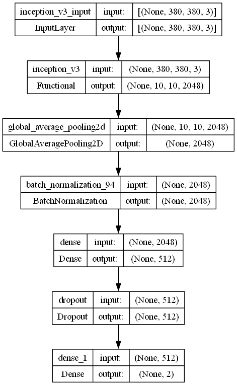
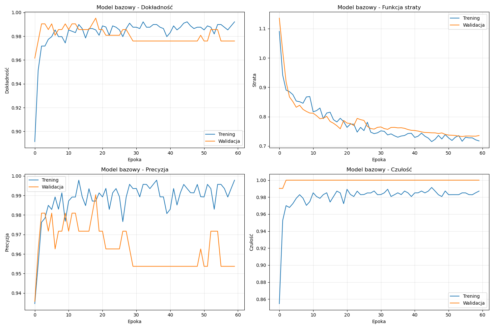
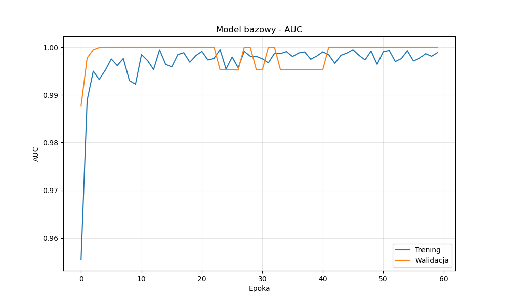
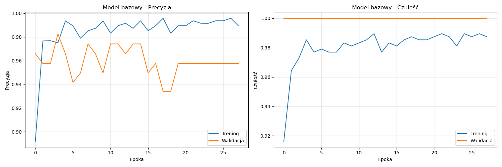
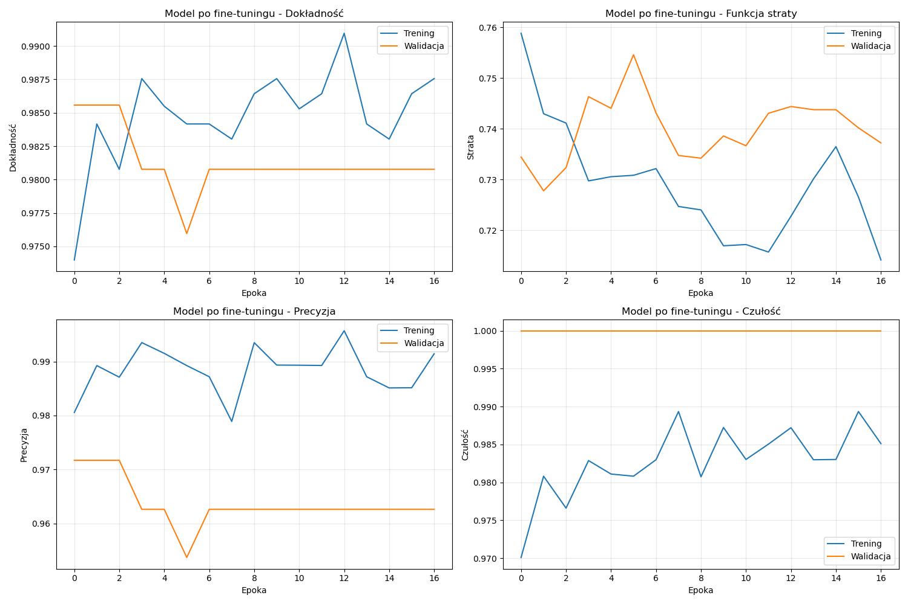
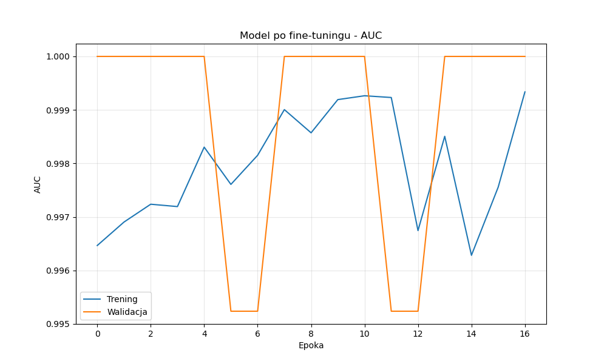
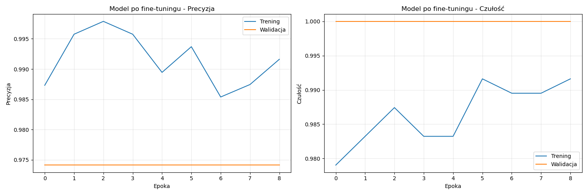
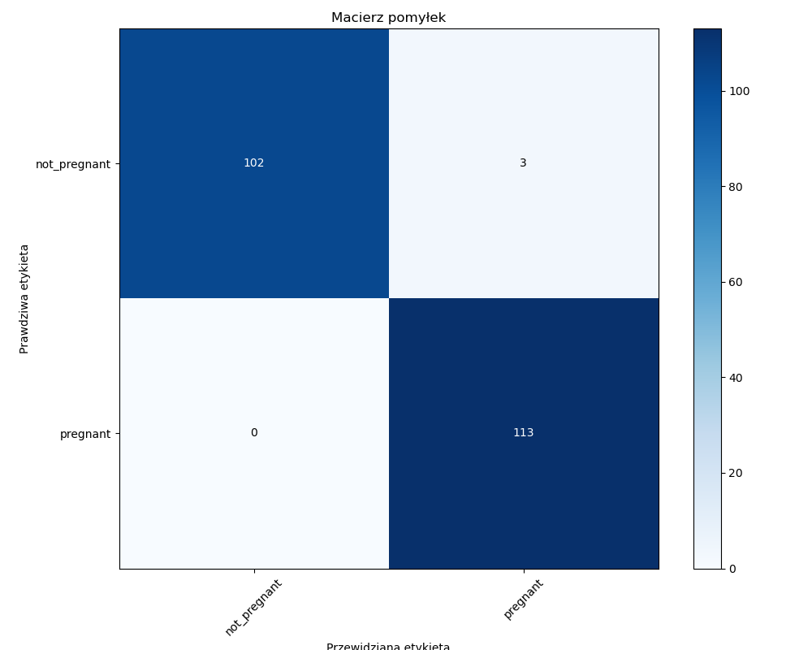
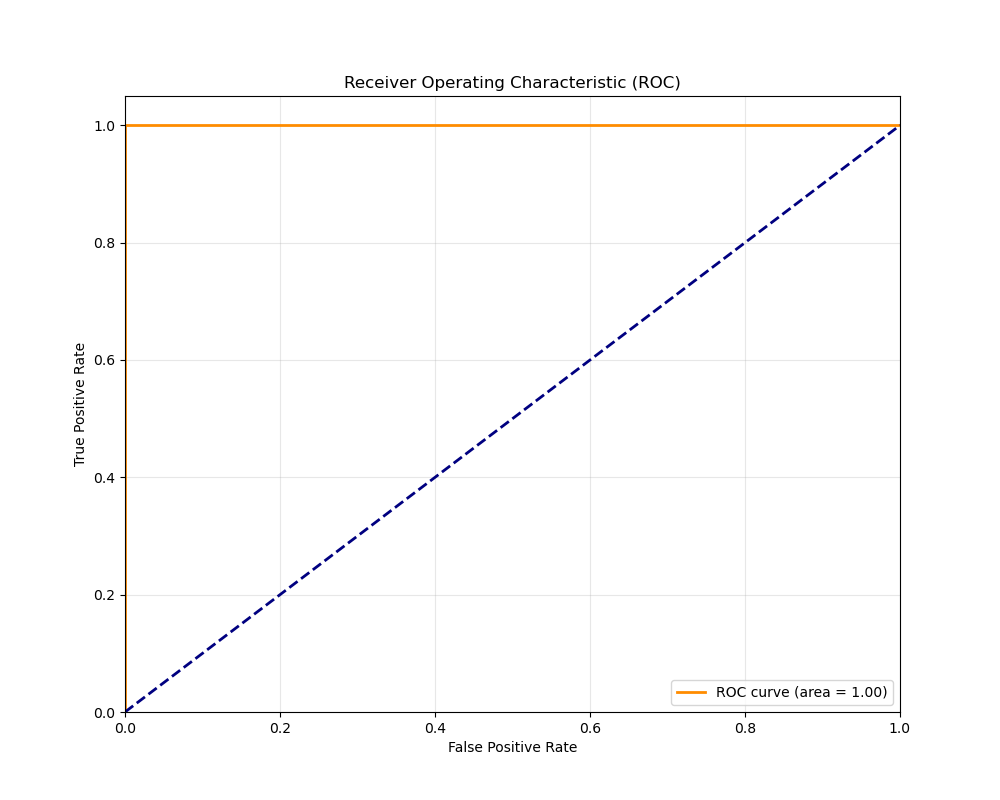
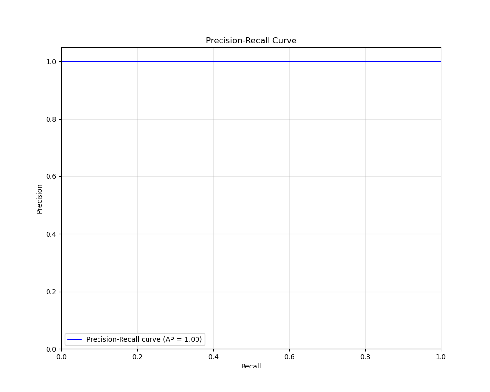

# Podsumowanie treningu modelu: Klasyfikacja obrazów USG klaczy (ci¹¿a vs brak ci¹¿y)

## 1. Architektura modelu

Model oparty o architekturê InceptionV3, dostosowany do klasyfikacji obrazów USG na dwie klasy: `pregnant` i `not_pregnant`.
Model bazuje na architekturze InceptionV3 z wejœciem o rozmiarze 380x380 pikseli. Na szczycie modelu znajduje siê w³asna, 
dopasowana g³owica klasyfikacyjna. Takie rozwi¹zanie zapewnia wysok¹ skutecznoœæ oraz zdolnoœæ do generalizacji 
nawet przy ograniczonych zbiorach danych medycznych.
---

## 2. Przebieg treningu

- **Rozmiar wejœciowy:** 380x380 pikseli  
- **Zbiór treningowy:** 900 obrazów  
- **Zbiór testowy:** 218 obrazów  
- **Epoki:** 60 (bazowy) + 40 (fine-tuning)  
- **Batch size:** 16  
- **Klasy:** `not_pregnant`, `pregnant`

---

### Historia treningu – model bazowy

#### Dok³adnoœæ

**Opis:**  
Szybki wzrost dok³adnoœci, stabilizacja na poziomie powy¿ej 96% ju¿ po kilku epokach - systematyczny wzrost dok³adnoœci 
zarówno dla zbioru treningowego, jak i walidacyjnego. Od pocz¹tku walidacyjna accuracy przekracza 0.96 i zbli¿a siê do 
wartoœci 0.99 ju¿ po kilku epokach, co potwierdza szybkie uczenie siê modelu i brak powa¿nego overfittingu.

#### Krzywa AUC

**Opis:**  
AUC zbli¿one do 1, bardzo dobra rozdzielczoœæ klas ju¿ od pocz¹tku treningu. Wartoœæ AUC (Area Under Curve) jest bardzo 
wysoka przez ca³y proces treningu. Œwiadczy to o zdolnoœci modelu do poprawnej klasyfikacji zarówno pozytywnych, 
jak i negatywnych przypadków nawet przy ró¿nych progach decyzyjnych.

#### Precision & Recall

**Opis:**  
Precyzja i recall na bardzo wysokim poziomie przez ca³y trening, bez wyraŸnego overfittingu. Zarówno precyzja, 
jak i recall utrzymuj¹ siê na wysokim, stabilnym poziomie, z minimalnymi ró¿nicami pomiêdzy zbiorem treningowym 
a walidacyjnym, co oznacza, ¿e model dobrze generalizuje.

---

### Fine-tuning

#### Dok³adnoœæ

**Opis:**
Podczas etapu fine-tuningu widoczna jest dalsza poprawa wyników oraz utrzymanie bardzo wysokiej dok³adnoœci na 
zbiorze walidacyjnym. Ostatecznie model osi¹ga praktycznie maksymaln¹ skutecznoœæ klasyfikacji.

#### Krzywa AUC

**Opis:**
Wartoœæ AUC pozostaje bliska 1, co oznacza, ¿e model nie tylko trafnie klasyfikuje, ale te¿ bardzo dobrze 
klasyfikuje poprawnie z du¿¹ pewnoœci¹ predykcji.

#### Precision & Recall

**Opis:**  
Model po fine-tuningu utrzymuje i lekko poprawia wysokie wartoœci dok³adnoœci, AUC oraz precyzji i recall. 
Precision, jak i recall osi¹gaj¹ bardzo wysokie wartoœci (powy¿ej 0.97) dla obu klas, nawet po fine-tuningu, 
co œwiadczy o stabilnoœci i skutecznoœci modelu.

---

## 3. Wyniki koñcowe

### Raport klasyfikacji (zbiór testowy)

| Klasa         | Precision | Recall | F1-score | Support |
|---------------|-----------|--------|----------|---------|
| not_pregnant  | 1.00      | 0.97   | 0.99     | 105     |
| pregnant      | 0.97      | 1.00   | 0.99     | 113     |
| **accuracy**  |           |        | **0.99** | 218     |
| macro avg     | 0.99      | 0.99   | 0.99     | 218     |
| weighted avg  | 0.99      | 0.99   | 0.99     | 218     |

---

Model osi¹gn¹³ bardzo wysok¹ skutecznoœæ (accuracy 0.99) z równowag¹ pomiêdzy precyzj¹ a recall dla obu klas. 
Praktycznie brak b³êdnych klasyfikacji.

### Macierz pomy³ek

**Opis:**  
Model poprawnie klasyfikuje zdecydowan¹ wiêkszoœæ przypadków. Zaledwie kilka próbek zosta³o b³êdnie sklasyfikowanych 
– co w praktyce oznacza bardzo wysok¹ niezawodnoœæ rozwi¹zania.

---

### Krzywa ROC

**Opis:**  
Krzywa ROC znajduje siê bardzo blisko lewego górnego rogu wykresu, co wskazuje na niemal perfekcyjn¹ skutecznoœæ modelu. 
Wysoka wartoœæ AUC (bliska 1.0) potwierdza doskona³¹ rozdzielczoœæ klas.

---

### Precision-Recall

**Opis:**  
Krzywa precision-recall utrzymuje siê bardzo wysoko dla obu klas, co oznacza, ¿e model nie tylko przewiduje poprawnie, 
ale te¿ jest odporny na fa³szywie pozytywne i negatywne wskazania.

---

## 4. Podsumowanie i rekomendacje

- **Accuracy:** 0.99  
- **Precision/Recall/F1:** >0.97 dla obu klas  
- **Brak overfittingu**, bardzo dobra generalizacja  
- **Model gotowy do walidacji na nowych zbiorach i wdro¿enia produkcyjnego**

---

| Wnioski                                                                                                          |
|------------------------------------------------------------------------------------------------------------------|
| Model osi¹ga 99% accuracy oraz bardzo wysokie wartoœci precision, recall i f1-score.                             |
| Wysokie wartoœci AUC oraz znakomita macierz pomy³ek wskazuj¹ na niezawodnoœæ klasyfikatora.                      |
| Zarówno w fazie treningu bazowego, jak i fine-tuningu model stabilnie siê uczy³ i nie przejawia³ oznak overfittingu. |
| Model jest gotowy do wdro¿enia lub dalszych testów na nowych zbiorach danych.                                    |

| Rekomendacje                                                                                                 |
|-------------------------------------------------------------------------------------------------------------|
| Dla pe³nej walidacji warto przetestowaæ model na zupe³nie nowych, niezale¿nych danych medycznych.           |
| Sugerowane jest dalsze monitorowanie wyników modelu po wdro¿eniu.                                           |

**Wszystkie wykresy i grafiki s¹ bezpoœrednio generowane w procesie treningu i odzwierciedlaj¹ stabilnoœæ oraz wysok¹ jakoœæ modelu.**

