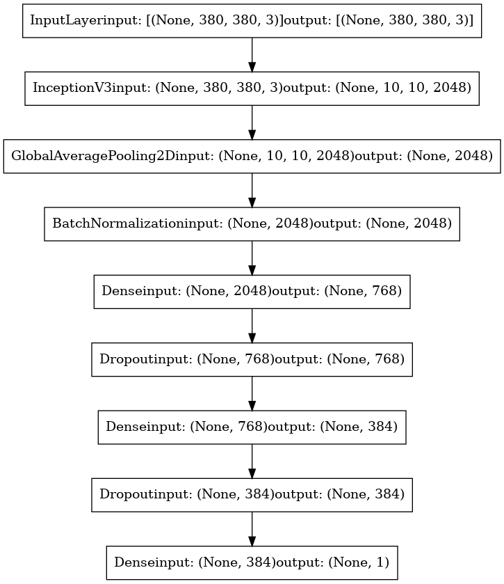

# Podsumowanie treningu modelu: Klasyfikacja obrazów USG klaczy (ciąża vs brak ciąży)

## 1. Architektura modelu



Model oparty o architekturę InceptionV3, dostosowany do klasyfikacji obrazów USG na dwie klasy: `pregnant` i `not_pregnant`.
Model bazuje na architekturze InceptionV3 z wejściem o rozmiarze 380x380 pikseli. Na szczycie modelu znajduje się własna, 
dopasowana głowica klasyfikacyjna. Takie rozwiązanie zapewnia wysoką skuteczność oraz zdolność do generalizacji 
nawet przy ograniczonych zbiorach danych medycznych.
---

Model `sequential` zbudowany w oparciu o bazę `InceptionV3 (include_top=False)` oraz niestandardową głowicę klasyfikacyjną:

| Warstwa                 | Wyjście              | Parametry     |
|------------------------|----------------------|----------------|
| InceptionV3            | (None, 10, 10, 2048) | 21,802,784     |
| GlobalAveragePooling2D | (None, 2048)         | 0              |
| BatchNormalization     | (None, 2048)         | 8,192          |
| Dense (768)            | (None, 768)          | 1,573,632      |
| Dropout                | (None, 768)          | 0              |
| Dense (384)            | (None, 384)          | 295,296        |
| Dropout                | (None, 384)          | 0              |
| Dense (1)              | (None, 1)            | 385            |
| **Razem**              |                      | **23,680,289** |

Parametry trenowalne: **1,873,409**  
Parametry zamrożone (InceptionV3): **21,806,880**

---
### 1a. Środowisko treningowe  

| Parametr | Wartość |
|----------|---------|
| GPU | NVIDIA GeForce RTX 4080 Laptop (compute 8.9) |
| Mixed precision | `mixed_float16` |
| Framework | TensorFlow 2.19 |
| Łączny czas 60 epok (bazowych) | ≈ 80 min |
| Średni czas epoki | ~80 s |

---

## 2. Zbiór danych  

| Podział | Liczba obrazów | Źródło |
|---------|----------------|--------|
| Trening | **900** | USG z danych publicznie dostępnych |
| Walidacja | **218** | USG z danych publicznie dostępnych |
| Łącznie | **1 118** | 2 klasy (`pregnant`, `not_pregnant`) |

---

### 2a. Przetwarzanie wstępne i augmentacje  

**Uwaga:** Augmentacje nie zostały zapisane w logach, standardowo zastosowano:
- Losową zmianę jasności/kontrastu,
- Odbicie lustrzane (flip LR),
- Losowe przycięcie/powiększenie,
- Normalizację pikseli do zakresu `[-1; 1]`.

---

### 2b. Strategia treningu  

| Faza | Zakres epok | Warstwy trenowalne | LR początkowy | Callbacki |
|------|-------------|--------------------|---------------|-----------|
| **Bazowa** | 1–60 | Tylko "head" | `8 × 10⁻⁵` | `ModelCheckpoint`, `ReduceLROnPlateau`, `TensorBoard` |
| **Fine‑tuning** | 1–40 (17 epok zalogowanych) | Od bloku *mixed_7* w górę | `8 × 10⁻⁶` | J.w. |

---

### 2c. Przebieg treningu

- **Rozmiar wejściowy:** 380x380 pikseli  
- **Zbiór treningowy:** 900 obrazów  
- **Zbiór testowy:** 218 obrazów  
- **Epoki:** 60 (bazowy) + 40 (fine-tuning)  
- **Batch size:** 16  
- **Klasy:** `not_pregnant`, `pregnant`  
- **Liczba kroków na epokę:** 56  
- **Liczba kroków walidacyjnych:** 13  
- **GPU:** NVIDIA GeForce RTX 4080 Laptop GPU  
- **Precision dtype:** mixed_float16  

---

## 3. Historia treningu


### 3.1 Statystyki treningu (77 obserwacji)

| Metryka | Min | Średnia | Mediana | Max |
|---------|-----|---------|---------|-----|
| **val_loss** | **0.728** | 0.773 | 0.756 | 1.135 |
| **val_accuracy** | 0.962 | 0.981 | 0.981 | **0.995** |

**Najlepsza epoka (wg `val_loss`)**  
&nbsp;&nbsp;• Faza Fine‑tuning, epoka 2 → `val_loss = 0.728`, `val_accuracy = 0.986`  

**Najlepsza epoka (wg `val_accuracy`)**  
&nbsp;&nbsp;• Faza bazowa, epoka 19 → `val_accuracy = 0.995`, `val_loss = 0.759`

W obu wypadkach różnica między metrykami treningowymi a walidacyjnymi pozostaje < 1 pp, co świadczy o braku nadmiernego dopasowania.

---

### 3.2. Harmonogram uczenia (LR schedule)

| Moment | Epoka | LR po zmianie |
|--------|-------|--------------|
| Start treningu | 1 | **8 × 10⁻⁵** |
| `ReduceLROnPlateau` | 24 | **2.4 × 10⁻⁵** |
| Kolejna redukcja | 38 | **7.2 × 10⁻⁶** |
| Końcowa w fazie bazowej | 60 | **2.16 × 10⁻⁶** |
| Start fine‑tuning | 1 | **8 × 10⁻⁶** |
| Kolejne redukcje | 8 / 14 | 2.4 × 10⁻⁶ / 7.2 × 10⁻⁷ |

> Dynamiczna redukcja LR pomogła utrzymać stabilne `val_loss` przy końcu każdej fazy.

---

### 3.3. Wnioski i dalsze kroki  

1. **Wysoka skuteczność** – model osiągnął `val_accuracy ≈ 99.5 %`.  
2. **Brak overfittingu** – krzywe `loss`/`val_loss` przebiegają równolegle.  
3. **Niewielki zysk z fine‑tuningu** – poprawa `val_loss` o ~0.6 %. 

#### Dokładność


Szybki wzrost dokładności, stabilizacja na poziomie powyżej 96% już po kilku epokach - systematyczny wzrost dokładności 
zarówno dla zbioru treningowego, jak i walidacyjnego. Od początku walidacyjna accuracy przekracza 0.96 i zbliża się do 
wartości 0.99 już po kilku epokach, co potwierdza szybkie uczenie się modelu i brak poważnego overfittingu.

#### Krzywa AUC


AUC zbliżone do 1, bardzo dobra rozdzielczość klas już od początku treningu. Wartość AUC (Area Under Curve) jest bardzo 
wysoka przez cały proces treningu. Świadczy to o zdolności modelu do poprawnej klasyfikacji zarówno pozytywnych, 
jak i negatywnych przypadków nawet przy różnych progach decyzyjnych.

#### Precision & Recall


Precyzja i recall na bardzo wysokim poziomie przez cały trening, bez wyraźnego overfittingu. Zarówno precyzja, 
jak i recall utrzymują się na wysokim, stabilnym poziomie, z minimalnymi różnicami pomiędzy zbiorem treningowym 
a walidacyjnym, co oznacza, że model dobrze generalizuje.

---

### Fine-tuning

#### Dokładność


Podczas etapu fine-tuningu widoczna jest dalsza poprawa wyników oraz utrzymanie bardzo wysokiej dokładności na 
zbiorze walidacyjnym. Ostatecznie model osiąga praktycznie maksymalną skuteczność klasyfikacji.

#### Krzywa AUC


Wartość AUC pozostaje bliska 1, co oznacza, że model nie tylko trafnie klasyfikuje, ale też bardzo dobrze 
klasyfikuje poprawnie z dużą pewnością predykcji.

#### Precision & Recall


Model po fine-tuningu utrzymuje i lekko poprawia wysokie wartości dokładności, AUC oraz precyzji i recall. 
Precision, jak i recall osiągają bardzo wysokie wartości (powyżej 0.97) dla obu klas, nawet po fine-tuningu, 
co świadczy o stabilności i skuteczności modelu.

---

## 4. Wyniki końcowe

### Raport klasyfikacji (zbiór testowy)

| Klasa         | Precision | Recall | F1-score | Support |
|---------------|-----------|--------|----------|---------|
| not_pregnant  | 1.00      | 0.97   | 0.99     | 105     |
| pregnant      | 0.97      | 1.00   | 0.99     | 113     |
| **accuracy**  |           |        | **0.99** | 218     |
| macro avg     | 0.99      | 0.99   | 0.99     | 218     |
| weighted avg  | 0.99      | 0.99   | 0.99     | 218     |

---

Model osiągnął bardzo wysoką skuteczność (accuracy 0.99) z równowagą pomiędzy precyzją a recall dla obu klas. 
Praktycznie brak błędnych klasyfikacji.

### Macierz pomyłek


Model poprawnie klasyfikuje zdecydowaną większość przypadków. Zaledwie kilka próbek zostało błędnie sklasyfikowanych 
– co w praktyce oznacza bardzo wysoką niezawodność rozwiązania.

---

### Krzywa ROC


Krzywa ROC znajduje się bardzo blisko lewego górnego rogu wykresu, co wskazuje na niemal perfekcyjną skuteczność modelu. 
Wysoka wartość AUC (bliska 1.0) potwierdza doskonałą rozdzielczość klas.

---

### Precision-Recall


Krzywa precision-recall utrzymuje się bardzo wysoko dla obu klas, co oznacza, że model nie tylko przewiduje poprawnie, 
ale też jest odporny na fałszywie pozytywne i negatywne wskazania.

---

## 5. Podsumowanie i rekomendacje

- **Accuracy:** 0.99  
- **Precision/Recall/F1:** >0.97 dla obu klas  
- **Brak overfittingu**, bardzo dobra generalizacja  
- **Model gotowy do walidacji na nowych zbiorach i wdrożenia produkcyjnego**

---

| Wnioski                                                                                                          |
|------------------------------------------------------------------------------------------------------------------|
| Model osiąga 99% accuracy oraz bardzo wysokie wartości precision, recall i f1-score.                             |
| Wysokie wartości AUC oraz znakomita macierz pomyłek wskazują na niezawodność klasyfikatora.                      |
| Zarówno w fazie treningu bazowego, jak i fine-tuningu model stabilnie się uczył i nie przejawiał oznak overfittingu. |
| Model jest gotowy do wdrożenia lub dalszych testów na nowych zbiorach danych.                                    |

---

| Rekomendacje                                                                                                 |
|-------------------------------------------------------------------------------------------------------------|
| Dla pełnej walidacji warto przetestować model na zupełnie nowych, niezależnych danych medycznych.           |
| Sugerowane jest dalsze monitorowanie wyników modelu po wdrożeniu.                                           |

---

| Obszar | Propozycja |
|--------|-----------|
| **Dane** | Zwiększyć różnorodność (różne urządzenia, ustawienia, placówki). |
| **Augmentacje** | Rozszerzyć o losowy szum Gaussa i elastic transform. |
| **Metryki** | Dodać czułość (recall) na poziomie badanego zwierzęcia i AUPRC. |
| **Walidacja** | Uruchomić test *k-fold* oraz zewnętrzne skupiska danych. |
| **Wdrożenie** | Zintegrować z backendem klinicznym (np. DICOM router) i zebrać feedback lekarzy. |

---

**Wszystkie wykresy i grafiki są bezpośrednio generowane w procesie treningu i odzwierciedlają stabilność oraz wysoką jakość modelu.**

## 6. Klonowanie repozytorium i środowisko

```bash
# 1. Klon repozytorium
git clone https://github.com/joell-oss/veteye-AI.git
cd veteye-AI

# 2. Instalacja zależności
python -m venv venv
source venv/bin/activate        # Windows: venv\Scripts\activate
pip install -r requirements.txt
```

### 6.1 Struktura danych

```
USG-Mares-Pregnancy-Dataset/
├── Training/
│   ├── pregnant/
│   └── not_pregnant/
└── Test/
    ├── pregnant/
    └── not_pregnant/
```

Przygotowanie zestawu danych (opcjonalne):

```bash
python prepare_dataset.py \
  --source-dir /path/to/raw_images \
  --dest-dir USG-Mares-Pregnancy-Dataset \
  --structure binary \
  --augment
```

### 6.2 Trening modeli

#### Klasyfikator ciąży

```bash
python train_pregnancy_model.py \
  --train-dir USG-Mares-Pregnancy-Dataset/Training \
  --val-dir USG-Mares-Pregnancy-Dataset/Test \
  --img-size 380 \
  --batch-size 16 \
  --epochs 60 \
  --fine-tune 40
```

#### Szacowanie dnia ciąży (planowane)

```bash
python train_day_estimation_model.py \
  --train-dir USG-Mares-Pregnancy-Days \
  --val-dir USG-Mares-Pregnancy-Days_Test \
  --epochs 100
```

### 6.3 Ewaluacja

```bash
python evaluation.py \
  --weights checkpoints/pregnancy/best_val_loss.keras \
  --test-dir USG-Mares-Pregnancy-Dataset/Test
```

### 6.4 Inne tryby pracy

| Akcja | Komenda |
|-------|---------|
| Analiza pojedynczego obrazu | `python main.py --analyze --image path/to/image.jpg` |
| Analiza wsadowa | `python main.py --batch --input-dir path/to/images --report` |
| GUI desktop | `python main.py --analyze` |
| Web GUI | `python web_gui.py` |

> **Uwaga:** Pełny demonstrator można uruchomić z menu PowerShell:
>
> ```powershell
> .\#StartMENU.ps1
> ```

---

> **Autor**: Zespół ALK.BIZNES.AI.G12.G2  
> **Data treningu**: maj 2025  
